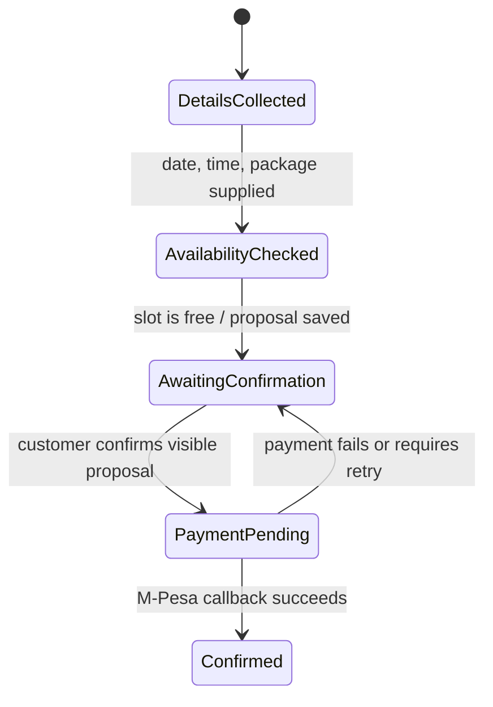
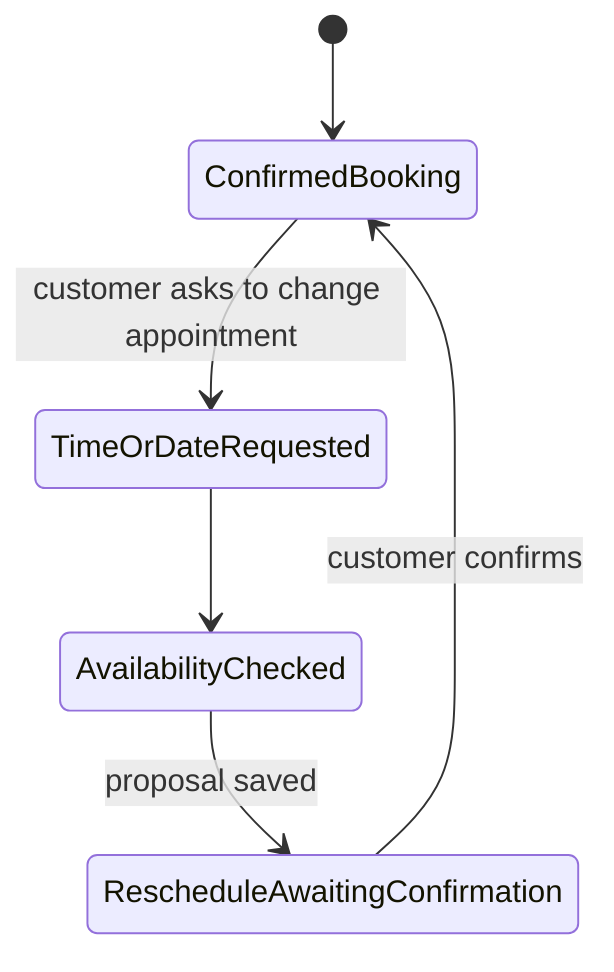

# Fiesta AI Backend 2.0

This document describes the current AI system in backend 2.0 as implemented today: architecture, model/runtime behavior, response style, reliability controls, performance characteristics, and data structure.

Product positioning:
- Fiesta AI — Conversational Booking and Business Assistant

Scope of this README:
- AI request lifecycle for WhatsApp, Instagram, and web chat.
- RAG retrieval and tool-calling behavior.
- Booking and rescheduling safety flow.
- Runtime resilience, fallback, escalation, and observability.
- Current performance strategy (debounce, caching, indexing, socket-first updates).

## 1) System Overview

Fiesta AI in backend 2.0 is a production conversational booking and business assistant for Fiesta House that:
- Accepts inbound customer messages from WhatsApp and Instagram webhooks.
- Supports direct web chat via `POST /api/chat`.
- Uses RAG context from Pinecone + local embedding pipeline.
- Uses a Groq-hosted chat model through the OpenAI SDK compatibility layer.
- Executes controlled tools for booking, rescheduling, availability, and session notes.
- Uses deterministic safeguards for payment-triggering actions.
- Logs AI job metrics and sentiment signals for monitoring.

Core entrypoint:
- [backend 2.0/app.ts](app.ts)

Core AI orchestrator:
- [backend 2.0/src/services/agent/agent.service.ts](src/services/agent/agent.service.ts)

## 2) High-Level Architecture

```mermaid
flowchart TD
   WA[WhatsApp Webhook]\
   IG[Instagram Webhook]\
   WEB[Web Chat API]

   WA -->|verify signature| WAC[WhatsApp Controller]
   IG -->|verify signature| IGC[Instagram Controller]
   WEB --> CHATC[Chat Controller]

   WAC --> DB[(PostgreSQL via Prisma)]
   IGC --> DB
   CHATC --> AGENT[Agent Service]

   WAC --> DEBOUNCE[Debounce Service]
   IGC --> DEBOUNCE
   DEBOUNCE --> AGENT

   AGENT --> RAG[Knowledge Retrieval Service]
   RAG --> EMBED[Xenova all-MiniLM-L6-v2]
   RAG --> PINE[Pinecone Index]

   AGENT --> LLM[Groq Chat Model via OpenAI SDK]
   AGENT --> BOOK[Booking Service]
   AGENT --> CAL[Google Calendar Service]
   AGENT --> MPESA[M-Pesa Service]
   AGENT --> NOTIFY[Notification Service]

   NOTIFY --> SOCKET[Socket.io Admin Events]
   SOCKET --> DASH[Admin Frontend]

   AGENT --> METRIC[(AiJobMetric + SentimentScore + CustomerMemory)]
   BOOK --> DB
   CAL --> GCAL[Google Calendar]
   MPESA --> PAY[(Payment + Booking Draft)]
```

## 3) Runtime Style and Behavioral Contract

The assistant is intentionally style-constrained by system prompt rules in [backend 2.0/src/services/agent/agent.service.ts](src/services/agent/agent.service.ts):
- Friendly, empathetic, professional tone.
- Concise responses (target under 800 chars).
- Never fabricate booking data/time.
- Mandatory two-step booking and two-step reschedule flow.
- Platform-aware constraints:
   - On Instagram/Facebook: booking creation is disallowed; user is redirected to WhatsApp.
   - On WhatsApp/Web: booking tools are available.

This gives a hybrid behavior model:
- LLM handles language and conversational reasoning.
- Deterministic code paths enforce side-effect safety.

## 4) AI Model Stack and Configuration

### Chat model
- SDK: `openai` npm package.
- Provider endpoint: `https://api.groq.com/openai/v1`.
- API key: `GROQ_API_KEY`.
- Model selection order:
   1. `GROQ_CHAT_MODEL`
   2. `OPENAI_CHAT_MODEL`
   3. fallback default `llama-3.1-8b-instant`

Reference:
- [backend 2.0/src/services/agent/agent.service.ts](src/services/agent/agent.service.ts)

### Embeddings and retrieval
- Local embedder model: `Xenova/all-MiniLM-L6-v2`.
- Retrieval source: Pinecone vector index (`PINECONE_INDEX_NAME`, default `ai-business`).
- Default retrieval behavior: `topK=5` (agent calls with 10), `minScore=0.22` threshold.

References:
- [backend 2.0/src/services/knowledge/retrieval.service.ts](src/services/knowledge/retrieval.service.ts)
- [backend 2.0/src/services/knowledge/ingestion.service.ts](src/services/knowledge/ingestion.service.ts)
- [backend 2.0/src/services/knowledge/pinecone.service.ts](src/services/knowledge/pinecone.service.ts)

### Environment validation
Startup fails fast if critical env vars are missing/placeholder.

Reference:
- [backend 2.0/src/config/env-validation.ts](src/config/env-validation.ts)

## 5) End-to-End Request Lifecycle

### 5.1 WhatsApp inbound
1. `POST /webhooks/whatsapp` hits webhook route.
2. Signature verification runs (`verifyWhatsAppWebhook`).
3. Message deduplication by `externalId`.
4. Inbound message is persisted.
5. Non-text messages receive a fixed acknowledgement and skip AI.
6. Text messages are debounced per customer (6s pause window).
7. On flush, pending inbound burst is merged into one turn.
8. Agent runs with last conversation context and returns reply.
9. Outbound AI reply is persisted and sent via provider API.

References:
- [backend 2.0/src/routes/whatsapp.routes.ts](src/routes/whatsapp.routes.ts)
- [backend 2.0/src/middleware/verifyWebhook.ts](src/middleware/verifyWebhook.ts)
- [backend 2.0/src/controllers/whatsapp.controller.ts](src/controllers/whatsapp.controller.ts)
- [backend 2.0/src/services/messaging/debounce.service.ts](src/services/messaging/debounce.service.ts)

### 5.2 Instagram inbound
Flow is analogous to WhatsApp, but customer identity is mapped by `instagramId`.

References:
- [backend 2.0/src/routes/instagram.routes.ts](src/routes/instagram.routes.ts)
- [backend 2.0/src/controllers/instagram.controller.ts](src/controllers/instagram.controller.ts)

### 5.3 Web chat inbound
`POST /api/chat` directly calls `agentService.handleMessage(customerId, message, [], 'web')`.

Reference:
- [backend 2.0/src/controllers/chat.controller.ts](src/controllers/chat.controller.ts)

## 6) Agent Pipeline (What Actually Happens)

`handleMessage(...)` is the safe public API. It never throws to callers.

Order of operations:
1. Start timer for latency metric.
2. Run best-effort sentiment heuristic tracking.
3. Circuit-breaker gate check.
4. Daily token budget check (enforced in production only).
5. Run deterministic conversation flows for known, low-risk customer intents.
6. Run the confirmation fast-path only when a short confirmation follows an explicit proposal.
7. Execute the full `runAgent(...)` RAG/tool-calling pipeline when no deterministic flow applies.
8. Record token usage and AI job metric.
9. Update customer memory (best effort).
10. On errors: trip breaker logic, create escalation if appropriate, return safe fallback message.

Reference:
- [backend 2.0/src/services/agent/agent.service.ts](src/services/agent/agent.service.ts)

## 7) Tool-Calling Architecture

Tools are registered dynamically by platform:
- Always available: `add_session_note`.
- WhatsApp/Web only:
   - `propose_booking`
   - `confirm_booking`
   - `propose_reschedule`
   - `confirm_reschedule`
   - `get_available_slots`

The agent loops over tool calls up to `MAX_TOOL_ROUNDS = 5`.

### Critical booking safety invariants
These are enforced in code, not prompt-only:
- `confirm_booking` cannot execute if booking was proposed in the same turn.
- `confirm_booking` requires prior-turn draft state `awaiting_confirmation`.
- `confirm_reschedule` cannot execute if reschedule was proposed in the same turn.
- `confirm_reschedule` requires prior-turn draft state `reschedule_confirm`.

This prevents accidental payment prompt triggering from a single ambiguous message.

Reference:
- [backend 2.0/src/services/agent/agent.service.ts](src/services/agent/agent.service.ts)

## 8) Retrieval-Augmented Generation (RAG)

RAG flow:
1. Embed user query with local Xenova model.
2. Query Pinecone for nearest vectors.
3. Filter weak matches using score threshold.
4. Concatenate matched chunks into Business Context.
5. Inject context into system prompt for the chat model.

Ingestion flow:
- Scrape website + social sources.
- Chunk text.
- Embed each chunk.
- Upsert vectors to Pinecone.
- Save local JSON backup of embeddings.

References:
- [backend 2.0/src/services/knowledge/retrieval.service.ts](src/services/knowledge/retrieval.service.ts)
- [backend 2.0/src/services/knowledge/ingestion.service.ts](src/services/knowledge/ingestion.service.ts)

## 9) Reliability and Safety Controls

### 9.1 Circuit breaker
- Trips after 3 consecutive failures.
- Cooldown: 60 seconds.
- During open state, AI returns a static safe fallback.

### 9.2 Outage deduplication
- Provider-wide outage alerts are rate-limited (10-minute cooldown) to avoid alert floods.

### 9.3 Rate-limit/outage classification
- Provider 429 and `rate_limit_exceeded` are classified distinctly.

### 9.4 Token budget guard
- Per-customer daily token cap: 20,000.
- Enforced only in production.

### 9.5 Webhook authenticity
- Meta signatures verified from raw body.
- 360dialog shared-secret path supported.
- Optional local skip flag exists for troubleshooting only.

References:
- [backend 2.0/src/services/agent/resilience.service.ts](src/services/agent/resilience.service.ts)
- [backend 2.0/src/middleware/verifyWebhook.ts](src/middleware/verifyWebhook.ts)

## 10) AI Performance and Observability

### What is tracked
- Per-turn AI execution metrics in `AiJobMetric`:
   - `success`, `isFallback`, `failureReason`, `latencyMs`, breaker signals.
- Heuristic sentiment per inbound turn in `SentimentScore`.
- Customer profile/memory updates in `CustomerMemory`.

### Analytics endpoint
- AI performance summary endpoint computes:
   - avg latency
   - p95 latency
   - success rate
   - fallback rate
   - intent-level rollups (from `ConversationLearning`)
- Conversation learning inspector endpoint:
   - `GET /api/analytics/conversation-learning/recent?limit=50`
   - returns most recent learning rows for quick data-quality checks.

Reference:
- [backend 2.0/src/controllers/analytics.controller.ts](src/controllers/analytics.controller.ts)

### Important caveat
`ConversationLearning` is now written from the main agent pipeline (success and fallback paths). Early datasets may still be sparse/uneven until enough post-change traffic accumulates.

## 11) Data Structures the AI Relies On

Most important models:
- `Customer`
- `Message`
- `Booking`
- `BookingDraft`
- `Payment`
- `CustomerMemory`
- `SentimentScore`
- `Escalation`
- `Notification`
- `AiJobMetric`

Reference:
- [backend 2.0/prisma/schema.prisma](prisma/schema.prisma)

### Why `BookingDraft` matters
`BookingDraft.step` is the workflow state anchor that prevents unsafe booking/reschedule confirmations in the same model turn.

## 12) Current Performance Design

### 12.1 Cost and latency controls
- Debounced burst handling (6 seconds): one AI call for multi-message bursts.
- Fallback responses avoid long retries when provider is down.
- Production token budget cap prevents runaway conversations.

### 12.2 Notification path optimization
- Unread-count endpoint has short in-memory cache (5s TTL).
- Cache invalidated on create/read state changes.
- Socket pushes send count updates in real time.

Reference:
- [backend 2.0/app.ts](app.ts)

### 12.3 Indexing for hot query paths
Schema currently includes indexes tuned for high-frequency filters/sorts in notifications, messages, bookings, escalations, invoices, and reminder/followup scheduling.

Reference:
- [backend 2.0/prisma/schema.prisma](prisma/schema.prisma)

## 13) Channel and Provider Details

### WhatsApp provider switching
The messaging layer supports:
- `meta` (direct Graph API)
- `360dialog` (BSP route)

Provider selected by `WHATSAPP_PROVIDER`.

Reference:
- [backend 2.0/src/services/messaging/whatsapp.service.ts](src/services/messaging/whatsapp.service.ts)

## 14) Error Handling Philosophy

Design principle: customer-facing flow should degrade gracefully.

- Agent path returns fallback string instead of crashing chat flow.
- Escalation creation is best effort and non-blocking to customer response.
- Non-critical writes (memory updates, notes fallback) are protected from taking down the turn.

## 15) Setup and Run

Prerequisites:
- Node.js 20+
- PostgreSQL
- Groq API key
- Pinecone (optional but required for vector retrieval quality)

Install:
```bash
npm install
```

Environment:
- Copy [.env.example](.env.example) to `.env` and set real values.

Database:
```bash
npx prisma generate
npx prisma db push
```

Development:
```bash
npm run dev
```

Tests currently wired:
```bash
npm test
```

## 16) Security Notes

- Startup env validation prevents placeholder credentials in required fields.
- Webhook signature verification validates authenticity.
- Keep `WHATSAPP_WEBHOOK_SKIP_SIGNATURE=false` outside local troubleshooting.

## 17) Known Limitations (Current State)

1. Sentiment is heuristic keyword-based, not model-based.
2. Embeddings are generated by a lightweight local model; quality can plateau on nuanced queries.
3. Notification count cache is in-process only (single-instance scope).
4. Some analytics dimensions depend on `ConversationLearning` data that may be under-populated.
5. Non-text customer media currently gets a polite ack but not semantic understanding.

## 18) Practical Improvement Backlog

Near-term improvements with high ROI:
1. Add structured intent/confidence telemetry from agent responses.
2. Add semantic understanding for common media attachment types.
3. Add regression test fixtures for booking/reschedule state transitions.
4. Add distributed cache (Redis) only when scaling to multi-instance backend.

---

Internal project: Fiesta House AI operations backend.

## 19) Deterministic Conversation Flows

The system is deliberately hybrid. The LLM is useful for open-ended questions and natural dialogue, but it must not be the authority for facts that can change, irreversible actions, or time-sensitive scheduling decisions.

### Ownership

| Module | Responsibility |
| --- | --- |
| [conversation-flow.matcher.ts](src/services/agent/conversation-flow.matcher.ts) | Pure message/history recognition and time-only parsing. No database or network I/O. |
| [conversation-flow.handler.ts](src/services/agent/conversation-flow.handler.ts) | Ordered selection of informational flows. |
| [agent.service.ts](src/services/agent/agent.service.ts) | Orchestration, persistence, side effects, metrics, tool calling, and LLM fallback. |
| [booking-draft.service.ts](src/services/booking/booking-draft.service.ts) | Booking-draft persistence for proposals and payment state. |
| [booking.service.ts](src/services/booking/booking.service.ts) | Single availability authority used by the AI and the admin booking UI. |

### Flow precedence

The order matters. A deterministic answer runs before retrieval and model extraction, preventing avoidable latency and eliminating invented facts for these cases:

1. Booking status, past appointment correction, multi-person booking clarification, and payment resend.
2. Business introduction, weekday, website, contact details, and portfolio questions.
3. Time-only reschedule request and the customer's replacement time.
4. Pending-booking continuation using the same date/time.
5. Package selection, package advice/comparison, and package catalog questions.
6. Explicit confirmation of a visible booking/reschedule proposal.
7. RAG plus LLM/tool calling for all other messages.

This is not intended to replace the AI. It gives the AI a reliable floor: current package facts, correct dates, valid booking transitions, and safe payments are code-controlled. The model is then free to handle the nuanced parts of the conversation.

### Examples

| Customer message | Handler behavior |
| --- | --- |
| "Tell me about the business" | Short studio introduction, then one natural follow-up question. |
| "What is your website?" | Returns the canonical website directly. No RAG or model request. |
| "Which day is the 5th?" | Resolves the date from conversation history when available and calculates the weekday deterministically. |
| "I like the Executive" | Uses the live package table and asks for a date unless an active proposal exists. |
| "Let's use the same date and time" | Retains the pending slot, validates it for the selected package duration, and refreshes the proposal. |
| "Can we change the time?" | Retains the appointment date and asks only for a replacement time. |
| "11am" after a time-only request | Checks availability, creates a reschedule proposal, then waits for confirmation. |
| "Yes" | Applies a proposal only if the immediately preceding assistant message explicitly asked for confirmation. |

## 20) Booking and Rescheduling State Machines

### Booking



`BookingDraft.step` stores the active transition state:

| Step | Meaning |
| --- | --- |
| `awaiting_confirmation` | Package, date, and time have been proposed. No payment has been requested yet. |
| `payment_pending` | M-Pesa STK push was initiated. Booking becomes confirmed only after the callback. |
| `reschedule_confirm` | A new appointment time has been proposed for an existing confirmed booking. |

### Rescheduling



Rules enforced in code:

- Only a future confirmed booking can be rescheduled or cancelled.
- Rescheduling is always two turns: propose, then explicit confirmation.
- A proposal cannot be confirmed in the same model turn that created it.
- A generic confirmation cannot apply a stale draft. The preceding assistant message must explicitly request confirmation.
- Changing a package while a booking is pending preserves the existing date/time only after rechecking availability using the new package duration.
- A time-only reschedule preserves the existing date and checks the requested new time before it is proposed.
- Past appointments are not offered reschedule/cancel actions. The assistant instead asks whether the session occurred or was missed, and can help create a new booking.

## 21) Source of Truth and Data Authority

The system has different authoritative stores for different kinds of information. Keeping these boundaries clear prevents stale RAG data from becoming an operational fact.

| Data | Authority | Used for |
| --- | --- | --- |
| Package name, price, deposit, duration, images, inclusions | PostgreSQL `Package` records | Package catalog, recommendation, comparison, deposit, duration. |
| Live booking state | PostgreSQL `Booking` records | Upcoming/past checks, rescheduling, cancellation, reminders. |
| Pending customer action | PostgreSQL `BookingDraft` records | Booking/payment/reschedule state transitions. |
| Payment result | M-Pesa callback persisted in `Payment` | Final booking confirmation. |
| Time availability | `BookingService` plus PostgreSQL bookings/drafts and Google Calendar events | AI and admin dashboard availability. |
| General studio knowledge | Pinecone retrieval corpus | Open-ended informational conversation only. |
| Public website | `https://www.fiestahousematernity.com/` | All outbound website responses. Legacy `fiestahouseattire.com` URLs are rewritten before model-generated messages are sent. |

Never rely on embeddings for package price, deposit amount, availability, booking confirmation, rescheduling, or payment state.

## 22) Timezone and Date Rules

All customer-facing appointment logic uses the `Africa/Nairobi` business timezone through [time.ts](src/utils/time.ts).

The helper provides:

- `nowInBusinessTimezone()` for current business time.
- `inBusinessTimezone(value)` for formatting stored UTC timestamps for customers.
- `businessDay(date)` for Nairobi calendar-day boundaries.

This is important because PostgreSQL/JavaScript timestamps are instants while appointments are planned by Nairobi calendar day. For example, the beginning of `2026-09-05` in Nairobi is `2026-09-04T21:00:00.000Z`.

Timezone-aware code is used for:

- availability day windows and Monday closure;
- overlap checks against bookings, pending payment drafts, and Google Calendar events;
- reminder and follow-up date ranges;
- relative date extraction and weekday answers;
- customer-facing appointment times.

## 23) Model, Retrieval, and Tool Use

### Chat model

The chat provider is Groq through the OpenAI-compatible SDK. The default model is `llama-3.1-8b-instant`, overridable through `GROQ_CHAT_MODEL` or `OPENAI_CHAT_MODEL`.

The model receives:

- current Nairobi date/time;
- customer identity, memory, past bookings, and next appointment summary;
- retrieved business context when the request reaches the RAG path;
- recent conversation history;
- platform-specific tool definitions;
- safety, state-transition, and customer-voice instructions.

### Booking extractor

`BookingExtractor` uses a cheap regex pass followed by a strict JSON extraction model call when needed. It extracts name, package, date, and time for the tool-calling path. Deterministic flows return before this extractor runs.

### Tool-call control

The model can call tools only from the registered platform-appropriate list. Tool results are appended to the conversation, and the model can continue up to five rounds. Runtime guards reject unsafe calls even if the model asks for them.

Important controls:

- malformed provider tool names are normalized and retried once with a hard tool-name instruction;
- a booking/reschedule confirmation blocks further booking actions in that turn;
- proposal and confirmation cannot occur in the same turn;
- reschedule proposals require customer-supplied date and time;
- availability is rechecked in code before a reschedule proposal is saved.

## 24) Customer Language and Outbound Formatting

The system prompt defines a calm, warm, attentive studio-assistant voice for expectant mothers. It aims for direct WhatsApp conversation rather than a brochure, menu, or support script.

The model is instructed to:

- use plain everyday language and contractions;
- ask one useful question at a time;
- avoid canned openers such as "Sure thing" and "Absolutely" when they add no meaning;
- avoid repeated options and unnecessary booking pressure;
- correct prior bad guidance plainly;
- avoid Markdown, headings, numbered menus, and formatting syntax in customer messages.

`formatCustomerReply()` enforces the last rule defensively for model-generated responses. It strips Markdown emphasis, code ticks, bullets, and numeric list prefixes, normalizes excessive newlines, and replaces any legacy website URL with the canonical site.

Payment callback messages are separate from model output and are also plain-text appointment confirmations.

## 25) API and Integration Boundaries

### Customer channels

| Surface | Entry point | Notes |
| --- | --- | --- |
| WhatsApp | `POST /webhooks/whatsapp` | Inbound message persistence, debounce, AI reply persistence, and provider send. |
| Instagram | Instagram webhook route | AI is informational only; bookings redirect to WhatsApp. |
| Web chat | `POST /api/chat` | Direct call to `AgentService.handleMessage`. |

### Operational APIs

| Endpoint | Purpose |
| --- | --- |
| `GET /api/bookings/available-hours/:date?service=...` | Admin booking UI availability. Delegates to the same `BookingService` as the AI. |
| `GET /api/calendar/events` | Confirmed booking events for the admin calendar. |
| `POST /api/calendar/sync` | Sync confirmed bookings without Google event IDs. |
| M-Pesa callback route | Verifies payment result, confirms booking, creates/updates calendar event, sends confirmation, and creates an invoice. |

### External systems

- **PostgreSQL/Supabase**: Prisma persistence for customers, messages, bookings, drafts, payments, notes, metrics, and notifications.
- **Groq**: OpenAI-compatible LLM API.
- **Pinecone**: vector retrieval index.
- **Google Calendar**: booking-event creation, update, deletion, and availability conflict lookup.
- **M-Pesa**: STK push and payment confirmation callback.
- **Meta WhatsApp Cloud API or 360dialog**: outbound/inbound WhatsApp transport.
- **Socket.io**: realtime admin notifications and dashboard updates.

## 26) Configuration Reference

Copy [.env.example](.env.example) to `.env`. Do not commit real secrets.

| Variable | Required for | Notes |
| --- | --- | --- |
| `PORT` | HTTP server | Defaults to application configuration when absent. |
| `DATABASE_URL` | PostgreSQL/Prisma | Required. |
| `GROQ_API_KEY` | Chat model and extractor | Required for generative paths. |
| `GROQ_CHAT_MODEL` | Chat model override | Optional. |
| `PINECONE_API_KEY`, `PINECONE_INDEX_NAME` | RAG | Required for vector retrieval. |
| `GOOGLE_SERVICE_ACCOUNT_KEY`, `GOOGLE_CALENDAR_ID` | Calendar integration | Required for calendar sync/conflict lookup. |
| `MPESA_*` | Deposits | Includes credentials, shortcode, passkey, callback URL, and environment. |
| `WHATSAPP_PROVIDER` | WhatsApp transport | `meta` or `360dialog`. |
| `WHATSAPP_*` / `D360_*` | WhatsApp transport | Provider-specific credentials. |
| `AI_ASSISTANT_NATURAL_MODE` | Informational-flow policy | Controls legacy deterministic informational responses; safety-critical flows remain deterministic. |
| `NODE_ENV=production` | Token budget enforcement | Enables the per-customer daily budget guard. |

## 27) Knowledge Ingestion and Maintenance

Knowledge ingestion is intentionally separate from transactional facts.

1. [website.scraper.ts](src/services/scraper/website.scraper.ts) and the social scraper collect source content.
2. [ingestion.service.ts](src/services/knowledge/ingestion.service.ts) chunks and embeds content with `Xenova/all-MiniLM-L6-v2`.
3. FAQ content from `knowledge_base_rows.json` is embedded alongside the question.
4. The existing Pinecone vector set is cleared before the new corpus is upserted, avoiding legacy chunks surviving a source replacement.
5. A local JSON backup is saved to `docs/business_knowledge_embeddings.json`.

After changing public facts such as website URLs, services, or policies:

1. update the authoritative FAQ/source content;
2. reseed the PostgreSQL knowledge records if applicable;
3. rerun ingestion to rebuild Pinecone;
4. verify the customer-facing response through the actual channel.

## 28) Testing and Verification

The current test command is:

```bash
npm test
```

It executes Node's built-in test runner with TypeScript support. Current coverage includes:

- sentiment scoring and circuit-breaker behavior;
- per-customer message debounce behavior;
- natural confirmation phrases, including "Let's do that";
- package-selection detection;
- time-only reschedule detection and time parsing;
- prevention of stale past-appointment menus;
- prevention of stale-draft confirmation after a question requesting more details;
- Nairobi timezone conversion and business-day boundaries.

When changing a conversation flow, add a regression test for the exact customer wording that exposed the issue. For database-mutating flows, add integration coverage using a disposable test database before making payment or calendar behavior changes.

Useful local checks:

```bash
npm test
npm run build
```

The TypeScript build may expose unrelated legacy errors outside the touched AI paths; distinguish those from diagnostics in the files being changed.

## 29) Operational Runbook

### A response is wrong or sounds scripted

1. Inspect the inbound message and recent message history in the admin conversation view.
2. Determine whether a deterministic flow should have handled it.
3. For package, availability, booking, or payment facts, fix the structured source or flow handler, not a prompt-only rule.
4. For general knowledge, update the knowledge source and rebuild the retrieval index.
5. Add a regression test for the customer wording.

### The assistant returns a fallback response

1. Check `AiJobMetric` and server logs for provider/network errors.
2. Check the circuit breaker state and the 60-second cooldown.
3. Verify Groq key, model name, and provider quota.
4. Confirm Pinecone/Google/M-Pesa failures are not being surfaced as chat-wide failures.
5. Review any resulting `Escalation` row.

### Availability looks wrong

1. Call `GET /api/bookings/available-hours/:date?service=...`.
2. Check local confirmed/provisional bookings, recent `payment_pending` drafts, and Google Calendar events.
3. Confirm the package duration in `Package` and `SERVICE_DURATIONS` is correct.
4. Confirm the date is being evaluated as an `Africa/Nairobi` calendar day.

### A customer says “yes” and the wrong action happens

1. Inspect the `BookingDraft` record and latest assistant message.
2. Confirmation should only occur after an immediately preceding explicit confirmation request.
3. If the assistant was collecting information instead, clear or replace the obsolete draft and add a flow-specific regression test.
