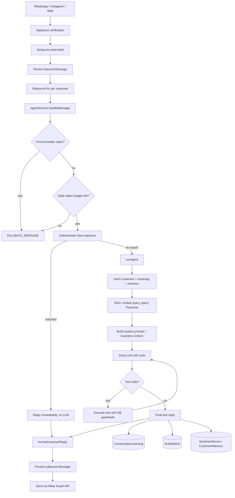
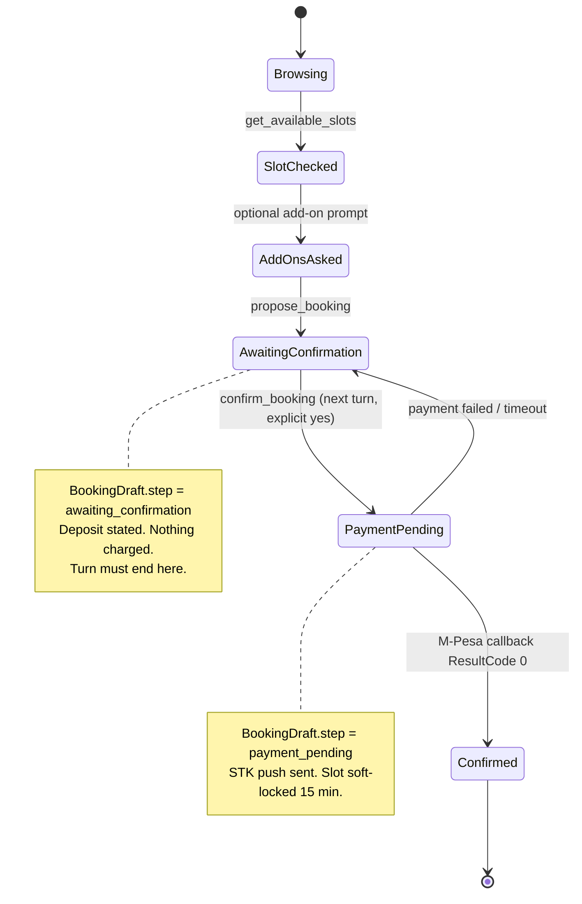

# Fiesta AI Engine — Technical Reference

| | |
|---|---|
| **System** | Fiesta House Maternity AI Assistant |
| **Codebase** | `backend 2.0` |
| **Audience** | Engineers, operators, and technical stakeholders |
| **Source of truth** | Live application source — paths, constants, thresholds, and model names are exact |
| **Last reviewed** | September 2026 |

---

## Purpose

This document describes how the AI engine processes customer conversations end to end: from inbound WhatsApp (or Instagram / web) messages through decision layers, tool execution, database writes, payments, calendar sync, and outbound replies.

It is the authoritative reference for architecture, safety invariants, and operational procedures.

---

## Contents

1. [Architecture overview](#1-architecture-overview)
2. [Message ingress](#2-message-ingress)
3. [Debouncing](#3-debouncing)
4. [Agent entry — `handleMessage`](#4-agent-entry--handlemessage)
5. [Deterministic reply layer](#5-deterministic-reply-layer)
6. [Knowledge base and RAG](#6-knowledge-base-and-rag)
7. [LLM loop — `runAgent`](#7-llm-loop--runagent)
8. [Tool catalog](#8-tool-catalog)
9. [Availability engine](#9-availability-engine)
10. [Packages and durations](#10-packages-and-durations)
11. [Add-ons, bespoke, and concierge](#11-add-ons-bespoke-and-concierge)
12. [Booking contract](#12-booking-contract)
13. [M-Pesa payments](#13-m-pesa-payments)
14. [Reschedule and cancellation](#14-reschedule-and-cancellation)
15. [Google Calendar](#15-google-calendar)
16. [Photo delivery](#16-photo-delivery)
17. [Reminders and follow-ups](#17-reminders-and-follow-ups)
18. [Outbound formatting](#18-outbound-formatting)
19. [Resilience](#19-resilience)
20. [Learning, metrics, and escalations](#20-learning-metrics-and-escalations)
21. [Data model](#21-data-model)
22. [Environment variables](#22-environment-variables)
23. [Operational runbook](#23-operational-runbook)

---

## 1. Architecture overview

Fiesta AI is a **hybrid agent**. The language model does not own irreversible outcomes. Messages fall through three layers in order:

| Layer | Role | Rationale |
|---|---|---|
| **Guardrails** | Circuit breaker, token budget, booking-state checks | Money and calendars must not be wrong |
| **Deterministic flows** | Regex matchers → canned or DB-driven replies | Fast, free, correct answers for known intents |
| **LLM + tools** | Groq-hosted model with function calling over RAG context | Natural language, reasoning, and edge cases |

The model cannot perform irreversible side effects alone. Charging a deposit, moving a booking, or cancelling is gated by a PostgreSQL state machine the model cannot see or bypass.



---

## 2. Message ingress

### Entry points

| Method | Path | File | Purpose |
|---|---|---|---|
| `GET` | `/webhooks/whatsapp` | `src/routes/whatsapp.routes.ts` | Meta `hub.challenge` verification |
| `POST` | `/webhooks/whatsapp` | same | Inbound WhatsApp messages and delivery statuses |
| `GET` | `/webhooks/instagram` | `src/routes/instagram.routes.ts` | Meta verification |
| `POST` | `/webhooks/instagram` | same | Inbound Instagram DMs |
| `POST` | `/api/chat` | `src/routes/chat.routes.ts` | Direct web chat (bypasses webhooks and debouncer) |
| `POST` | `/api/mpesa/callback` | `src/routes/payment.routes.ts` | Safaricom Daraja STK callback |

### Signature verification

**File:** `src/middleware/verifyWebhook.ts`

`express.json()` in `app.ts` captures the raw body. Meta signs the byte-exact payload; verifying a re-serialized JSON object would fail.

**Meta** (`WHATSAPP_PROVIDER=meta`, default):

1. Read `X-Hub-Signature-256` (`sha256=<hex>`).
2. Compute `HMAC-SHA256(rawBody, WHATSAPP_APP_SECRET)` (or `INSTAGRAM_APP_SECRET` for Instagram).
3. Constant-time compare. Mismatch → `401`.

**360dialog** (`WHATSAPP_PROVIDER=360dialog`):

- Compare `X-Webhook-Secret` to `WEBHOOK_SHARED_SECRET`.

**Dev bypass:** `WHATSAPP_WEBHOOK_SKIP_SIGNATURE=true` disables verification.

> **Production requirement:** Keep signature verification enabled. With the bypass on, anyone who knows the webhook URL can inject fake customer messages.

### Controller pipeline

**File:** `src/controllers/whatsapp.controller.ts`

For each inbound message:

1. **Deduplicate** on `Message.externalId` (`wamid…`). Meta retries aggressively; without this, one message can be processed multiple times.
2. **Upsert Customer** by phone (`customerId` is the phone, e.g. `254721840961`).
3. **Persist** inbound `Message` (`direction: 'inbound'`, `platform: 'whatsapp'`).
4. **Mark read** via Graph API.
5. **Non-text** (image, audio, video, sticker, document) → fixed acknowledgement; never reaches the AI (no vision/audio pipeline).
6. **Text** → `messageDebouncer.scheduleTurn(customerId, () => this.processPendingTurn(customerId))`.

Instagram follows the same structure, keyed on `instagramId` and deduped on `message.mid`.

---

## 3. Debouncing

**File:** `src/services/messaging/debounce.service.ts`  
**Constant:** `DEBOUNCE_MS = 6000`

Customers often send several short messages in sequence. Without debouncing, each webhook would trigger a separate AI turn with stale history, fragmented replies, and multiplied token cost.

The debouncer holds a `Map<customerId, NodeJS.Timeout>`. Each new message clears and restarts that customer’s 6-second timer. After a 6-second pause, `processPendingTurn` runs once:

- Loads all inbound messages since the last outbound message
- Concatenates them into a single `userMessage`
- Loads the last **10** messages as conversation history
- Calls `agentService.handleMessage(...)` once

This is the primary cost-control mechanism for multi-message bursts.

---

## 4. Agent entry — `handleMessage`

**File:** `src/services/agent/agent.service.ts`  
**Class:** `AgentService`

`handleMessage` is the sole public entry point. It is designed never to throw: callers always receive a string, including during full provider outage.

### Execution order

```
 1. Start latency timer
 2. Record sentiment heuristic (best-effort, non-blocking)
 3. circuitBreaker.isOpen()?                → FALLBACK_MESSAGE + escalation
 4. Daily token budget exceeded?            → FALLBACK_MESSAGE + 'quota' escalation
 5. shouldUseBookingStatusReply             → booking confirmation status
 6. shouldUseUpcomingAppointmentTimeReply   → session time inquiry
 7. shouldUsePastAppointmentReply           → past-date handling
 8. shouldUseMultiPersonBookingReply        → multi-person context
 9. shouldHandleResendRequest               → payment prompt resend
10. resolveInformationalFlow():
       business_introduction | weekday | website | contact_details | portfolio
11. If AI_ASSISTANT_NATURAL_MODE === false, also:
       social_media | raw_files | additions | bespoke
       travelling_mothers | earliest_delivery | post_shoot | booking_process
12. isTimeOnlyRescheduleSelection
13. isTimeOnlyRescheduleRequest
14. isSameBookingSlotRequest
15. isPackageSelection
16. isPackageAdviceRequest
17. isPackageCatalogRequest
18. Explicit-confirmation fast path
19. No match → runAgent() (LLM + tools)
```

Steps 5–9 remain deterministic even in natural mode. Incorrect answers here cause direct customer harm (for example, stating a booking is confirmed when it is not).

### Natural mode

```ts
private readonly naturalAssistantMode =
  String(process.env.AI_ASSISTANT_NATURAL_MODE || 'false').toLowerCase() === 'true';
```

| Mode | Behaviour |
|---|---|
| `false` | Maximum determinism — many canned replies short-circuit the LLM |
| `true` (current) | Only safety-critical routes stay hard-coded; informational questions go to the LLM |

Natural mode uses more tokens and depends on RAG coverage; it produces more conversational replies.

---

## 5. Deterministic reply layer

Two collaborating modules:

| Module | Responsibility |
|---|---|
| `src/services/agent/conversation-flow.matcher.ts` | Pure boolean regex matchers (no I/O) |
| `src/services/agent/conversation-flow.handler.ts` | `resolveInformationalFlow()` maps messages to named flows |

### Core matchers

| Method | Pattern (abridged) |
|---|---|
| `isPackageCatalogRequest` | packages / services list intent |
| `isPackageAdviceRequest` | package name **and** recommend / compare / best |
| `isPackageSelection` | choose / take / go with + edition name |
| `isSameBookingSlotRequest` | same date and time / same day |
| `isTimeOnlyRescheduleRequest` | change time **without** date language |
| `parseTimeOnly` | `at? HH(:mm)? am|pm` → `HH:mm` |
| `isTimeOnlyRescheduleSelection` | time parse + prior assistant asked for a new time |
| `isWeekdayRequest` | which day of week for a date |
| `isBusinessIntroductionRequest` | about the business / who are you |
| `isWebsiteRequest` | website / site |
| `isContactDetailsRequest` | contact / location / address |
| `isPortfolioRequest` | portfolio / gallery / sample photos |

### Agent-local matchers

Defined in `agent.service.ts` for booking process, post-shoot, delivery, raw files, additions, bespoke, travelling mothers, social, payment resend, multi-person booking, and booking status.

### Package catalog

`getPackageCatalogReply()` reads live from the `Package` table (`orderBy: price asc`) and renders via `buildPackageCard()`. Badges and name-conditional details (wigs, outfits, A2 vs A3 mount) are derived from edition names.

Price or package changes in the database take effect immediately — no redeploy or re-ingestion required for catalog replies.

---

## 6. Knowledge base and RAG

### Embedding model

**Model:** `Xenova/all-MiniLM-L6-v2`  
**Runtime:** Local in-process via `@xenova/transformers`  
**Dimensions:** 384 · mean pooling · L2 normalized  
**Cost:** No per-query API charge or rate limit

Loaded lazily on first use and cached on the service instance.

> The Pinecone index must be **384-dimensional** (currently `fiesta-ai-384`). A 1536-dim OpenAI-style index will fail on upsert.

### Ingestion

**File:** `src/services/knowledge/ingestion.service.ts`

```powershell
npx ts-node run_ingestion.ts
```

Pipeline:

1. **Scrape** — website (`website.scraper.ts`) plus Instagram captions via Meta Graph API (`social.scraper.ts`). If the Instagram token is missing or the API fails, social ingestion is skipped (no placeholders). FAQ rows still answer “where’s your Instagram?”.
2. **Chunk** — `chunkText(text, maxTokens = 250)` in `src/utils/chunking.ts`: split on sentence terminators, group until ~1000 characters; **no overlap**.
3. **Embed** — each chunk → 384-dim vector.
4. **Load FAQs** — embed `question + answer` from `knowledge_base_rows.json` / `KnowledgeBase` table.
5. **Upsert Pinecone** — `replaceVectors()` (upsert new IDs first, then delete orphans — zero-downtime).
6. **Local backup** — `docs/business_knowledge_embeddings.json`.

### Retrieval

**File:** `src/services/knowledge/retrieval.service.ts`

```ts
async search(query: string, topK: number = 5, minScore: number = 0.22)
```

The agent uses `topK = 10`. Results below `minScore` are dropped. Surviving chunks are joined with `\n---\n` and injected as **Business Context**.

| Score band | Meaning |
|---|---|
| 0.08 – 0.10 | Noise floor |
| 0.22 – 0.48 | Valid matches (0.42–0.48 ≈ near-perfect) |
| ≥ 0.50 | Too aggressive for MiniLM — filters correct answers |

MiniLM cosine scores run lower than commercial embedders; a 0.5 threshold silently breaks retrieval for this stack.

### Knowledge coverage

`knowledge_base_rows.json` (~62 rows) covers general FAQs, services, packages, preparation, policies, booking, facility, and contact.

```powershell
npx ts-node scripts/seed-knowledge-base.ts   # PostgreSQL only
npx ts-node run_ingestion.ts                 # Pinecone — required for RAG
```

Both steps are required for knowledge changes to reach the LLM.

---

## 7. LLM loop — `runAgent`

### Model configuration

```ts
const openai = new OpenAI({
  apiKey: process.env.GROQ_API_KEY,
  baseURL: 'https://api.groq.com/openai/v1',
});

const CHAT_MODEL = process.env.GROQ_CHAT_MODEL
  || process.env.OPENAI_CHAT_MODEL
  || 'llama-3.1-8b-instant';
```

Groq is OpenAI-wire-compatible. Current deployment model: **`openai/gpt-oss-20b`**. Temperature **0.3** for conversation; **0** for extraction and malformed-tool-name retry.

### Context assembly

Each turn includes customer phone and name, upcoming and past bookings, customer memory, and RAG business context.

### Draft-step snapshot (critical safety invariant)

```ts
const draftBeforeThisTurn = await prisma.bookingDraft.findUnique({ where: { customerId } });
const initialDraftStep = draftBeforeThisTurn?.step;
```

Captured **before any tool runs**. `confirm_booking` and `confirm_reschedule` validate against this snapshot, not the live DB value. A `propose_booking` earlier in the same turn cannot satisfy confirmation. Confirmation is valid only if the proposal was pending from a **prior** customer message — so one ambiguous sentence cannot trigger an M-Pesa charge.

### Booking extraction

`BookingExtractor.extract()` runs regex first (name, service, date, time). If all four fields resolve, it returns with zero tokens; otherwise one `temperature: 0` LLM call merges with regex-preferred fields.

> **Known gap:** Extractor regex still lists legacy package names. New Editions fall through to the AI extractor. Impact is cost only — tools set the real service.

### Tool loop

```ts
const MAX_TOOL_ROUNDS = 5;
```

Each round: parse args → execute with guardrails → push `role: 'tool'` result → re-call model. Exits on plain text or after five rounds.

### Malformed tool-name recovery

Some providers emit control tokens in function names (e.g. `propose_reschedule<|channel|>commentary`). `createCompletionWithToolNameGuard` recovers the name via `normalizeToolName()`, retries once with an explicit tool-name rule and `temperature: 0`.

### Date weekday grounding

Tool results embed the resolved weekday label. The model must use that label and must not infer weekday from ISO strings alone.

---

## 8. Tool catalog

### All platforms

| Tool | Parameters | Effect |
|---|---|---|
| `add_session_note` | `bookingDate`, `note`, `type` ∈ `external_people \| external_items \| special_request \| other` | Creates `CustomerSessionNote` (companions, add-ons, special requests) |

### WhatsApp and web only

| Tool | Parameters | Effect |
|---|---|---|
| `get_available_slots` | `date`, `service` | Full availability algorithm |
| `propose_booking` | `customerName`, `service`, `date`, `time` | Writes draft `awaiting_confirmation`; states deposit; **charges nothing** |
| `confirm_booking` | *(none)* | Only if `initialDraftStep === 'awaiting_confirmation'`; fires STK push |
| `propose_reschedule` | `newDate`, `newTime` | Validates slot; draft `reschedule_confirm` |
| `confirm_reschedule` | *(none)* | Only if `initialDraftStep === 'reschedule_confirm'`; updates booking + calendar |
| `cancel_booking` | *(none)* | `status: 'cancelled'`; deletes calendar event |
| `save_delivery_preference` | `method`, optional contact fields | Validates/stores preference; notifies admin |

Booking tools are **structurally omitted** from Instagram and Facebook schemas — not merely discouraged in the prompt.

### Tool errors as teaching signals

Failed tool results return instructional text (e.g. available times and weekday label). The model self-corrects within the same turn.

---

## 9. Availability engine

**File:** `src/services/booking/booking.service.ts`  
**Method:** `getAvailableSlots(date, durationMinutes, excludeBookingId?)`

### Constants

| Setting | Value |
|---|---|
| Business start | 09:00 |
| Business end | 19:00 |
| Slot granularity | 30 minutes |
| Closed day | Monday |
| Draft hold window | 15 minutes |
| Timezone | Africa/Nairobi (`src/utils/time.ts`) |

### Algorithm

1. Load non-cancelled local bookings for the date (minus `excludeBookingId` on reschedule).
2. Load `BookingDraft` rows with `step = 'payment_pending'`, `updatedAt` within 15 minutes, matching date.
3. Load Google Calendar events for the day.
4. If Monday → `{ status: 'closed', reason: 'Closed on Mondays' }`.
5. For each 30-minute candidate from 09:00–18:30: skip if end past 19:00 or overlaps booking, pending draft, or calendar event.
6. Return available `HH:mm` strings.

Overlap uses half-open intervals: `slotStart < other.end && slotEnd > other.start`.

### Sources of truth

Availability is the intersection of:

1. Local bookings (AI-confirmed)
2. Pending drafts (in-flight STK)
3. Google Calendar (manual staff blocks)

Sync is **read-for-availability, write-for-bookings**. GCal events are never imported as `Booking` rows.

---

## 10. Packages and durations

### Catalog (`Package` table)

| Edition | Price | Duration | Photos | Outfits | Wig | Backdrop | Photobook | Mount |
|---|---|---|---|---|---|---|---|---|
| THE BLOOM | KSH 15,000 | 1.5 h | 6 | 2 | — | — | — | — |
| THE MUSE | KSH 25,000 | 2 h | 12 | 3 | — | — | — | — |
| THE ICON | KSH 35,000 | 2.5 h | 15 | 4 | — | — | — | A3 |
| THE LEGEND | KSH 45,000 | 2.5 h | 15 | 4 | 1 | — | 8×8 | — |
| THE QUEEN | KSH 55,000 | 3 h | 20 | 4 | 1 | ✓ | — | A3 |
| THE EMPRESS | KSH 70,000 | 3.5 h | 25 | 4 + Power Suit | 2 | ✓ | 8×8 | A3 |
| THE GODDESS | KSH 120,000 | 5 h | 30 | 5 + Power Suit | 2 | ✓ / Sculpture Set | 8×8 | A2 + Reel |

Deposit: **KSH 2,000** on every edition.

```powershell
npx ts-node scripts/seed-packages.ts
```

### Duration resolution

**File:** `src/config/constants.ts` — `SERVICE_DURATIONS` with edition and legacy keys; `DEFAULT_DURATION = 120`.

Resolution uses substring match on the lowercased service name. Legacy keys remain so historic bookings still resolve calendar blocks correctly.

System prompt rule **#26** treats Standard / Economy / Executive / Gold / Platinum / VIP / VVIP as retired.

---

## 11. Add-ons, bespoke, and concierge

### Additions pricing

| Item | Price |
|---|---|
| Extra edited photo | KSH 1,000 / photo |
| Extra digital art edit | KSH 3,000 / photo |
| Extra outfit beyond package | KSH 4,000 / outfit |
| Extra professional makeup | KSH 3,500 / session |
| Fiesta House Power Suit (where not included) | KSH 10,000 |
| Styled wig hire | KSH 4,000 / wig · book in advance |
| Wig styling only | KSH 3,000 / wig · book in advance |
| Suspending Concept | KSH 7,000 |
| Goddess Sculpture Set (where not included) | KSH 15,000 |
| Professional Reel | Quoted by tier · book in advance |
| Raw files | Quoted by package tier |

Surfaced via deterministic reply (non-natural mode), knowledge-base RAG (natural mode), and system prompt rule **#26**.

### Optional add-on prompt (rule 13b)

During booking, the model may ask about optional add-ons. Declines proceed immediately. Add-ons are not priced into the deposit; they settle with the balance. Accepted add-ons are stored as `CustomerSessionNote` (no `BookingAddon` line-item model).

### Bespoke and travelling mothers

- **Bespoke** — custom experiences by consultation; always routes to a human; AI never quotes a price.
- **Travelling mothers** — airport transfer / hotel / concierge for mothers outside Nairobi; available on request.

---

## 12. Booking contract



### Dual locks

1. **`proposedThisTurn`** — blocks propose→confirm chaining inside one turn  
2. **`initialDraftStep`** — DB snapshot from before the turn began  

Even if the model ignores prompt instructions, the deposit prompt cannot appear without an explicit customer confirmation on a separate message.

### Prerequisites for `propose_booking`

1. Real name (placeholders rejected)
2. Service resolvable via `SERVICE_DURATIONS`
3. Date not Monday
4. Time confirmed free via `get_available_slots`

---

## 13. M-Pesa payments

**Files:** `src/services/payment/mpesa.service.ts`, `src/controllers/payment.controller.ts`

### Outbound STK push

`initiateStkPush(phone, amount, bookingId)`:

1. OAuth with consumer key/secret  
2. Password = `base64(SHORTCODE + PASSKEY + timestamp)`  
3. Normalize phone to `254XXXXXXXXX`  
4. POST STK process request  
5. Persist `Payment` with `CheckoutRequestID`, `status: 'pending'`  
6. Move draft to `payment_pending`  

Base URL depends on `MPESA_ENVIRONMENT` (`sandbox` or `production`).

### Inbound callback

`POST /api/mpesa/callback`

**On `ResultCode === 0`:**

1. Look up `Payment` by `checkoutRequestId`
2. Extract `MpesaReceiptNumber`
3. If linked to a draft → create confirmed `Booking`, delete draft
4. Else if linked to existing booking → set `confirmed`
5. Update payment to `success`
6. Create Google Calendar event; store `googleEventId`
7. Send customer confirmation
8. Generate `Invoice` (`INV-{YYYY}-{seq}`, PDF in `pdfData`)

**On failure:** `Payment.status = 'failed'`; draft remains until the 15-minute hold lapses.

### Resend

Resend only if a genuinely pending `Payment` exists. After success, the AI never offers to resend (avoids double-charge appearance).

---

## 14. Reschedule and cancellation

### Two-step reschedule

```
propose_reschedule  →  BookingDraft.step = 'reschedule_confirm'
confirm_reschedule  →  requires initialDraftStep === 'reschedule_confirm'
```

`propose_reschedule` finds the next confirmed upcoming booking, resolves duration from the existing service, checks availability with `excludeBookingId`, and upserts the draft.

### Policy highlights

| Rule | Behaviour |
|---|---|
| Info vs reschedule | “When is my session?” is informational — no `propose_reschedule` |
| Incomplete request | “Can I reschedule?” with no date/time → ask only; no tool |
| Past appointments | Cannot reschedule or cancel; offer a new booking |
| Cancellation | Tool must run before claiming success; 72-hour notice keeps deposit |

---

## 15. Google Calendar

**File:** `src/services/calendar/calendar.service.ts`

| Aspect | Detail |
|---|---|
| Auth | Service account JSON in `GOOGLE_SERVICE_ACCOUNT_KEY` |
| Scope | `https://www.googleapis.com/auth/calendar` |
| Target | `GOOGLE_CALENDAR_ID` (default `primary`) |

| Method | Trigger | Action |
|---|---|---|
| `createEvent` | M-Pesa success | Create event; store `googleEventId` |
| `updateEvent` | `confirm_reschedule` | Patch start/end |
| `deleteEvent` | `cancel_booking` | Remove event |
| `getEvents` | Every availability check | Conflict detection |

The system writes bookings and reads calendar for conflicts only. Manual GCal events block AI bookings but are never imported as `Booking` rows.

---

## 16. Photo delivery

| Aspect | Policy |
|---|---|
| Format | Secure download link only — never chat attachments |
| Timeline | 10 working days after the shoot |
| Channels | Email · WhatsApp · download link |
| Express | Extra fee |
| Raw files | Quoted by package tier |

`save_delivery_preference` validates method and contact details, attaches to the next upcoming booking, writes a `CustomerSessionNote`, and notifies admin.

Media requests in chat are redirected to Instagram `@fiestahousematernity`, Facebook, or the website. Client photos are never shared publicly without consent.

---

## 17. Reminders and follow-ups

**Files:** `src/services/automation/cron.service.ts`, `automation.service.ts`

```ts
cron.schedule('0 * * * *', async () => {
  await automationService.processReminders();
  await automationService.processFollowups();
});
```

| Job | Window | Idempotency | Record |
|---|---|---|---|
| 24-hour reminder | Sessions tomorrow | No prior `BookingReminder` type `24hr` sent | `BookingReminder` |
| 5-day feedback | Sessions 5 days ago | No prior `PostShootFollowup` type `feedback` sent | `PostShootFollowup` |

Both loops catch per booking — one failed send does not abort the batch.

---

## 18. Outbound formatting

**File:** `src/services/messaging/customer-reply.templates.ts`  
**Function:** `formatCustomerReply(reply)`

| Transform | Reason |
|---|---|
| Strip `**` and backticks | WhatsApp renders `*x*`; backticks look like noise |
| Strip list scaffolding | Conversational tone (rule #22) |
| Strip emojis | Neutral templates (package cards bypass this) |
| Remove canned openers | e.g. “Sure thing”, “Absolutely” |
| Normalize whitespace | Collapse runaway blank lines |
| Rewrite legacy URL | `fiestahouseattire.com` → maternity domain |

Shared templates cover awaiting confirmation, payment pending/failed, reminders, feedback, and reschedule confirmed.

---

## 19. Resilience

**File:** `src/services/agent/resilience.service.ts`

### Circuit breaker

| Setting | Value |
|---|---|
| Failure threshold | 3 consecutive failures |
| Cooldown | 60 seconds |
| Recovery | Half-open: one probe; success resets, failure re-opens |

While open, requests short-circuit to `FALLBACK_MESSAGE` with no provider call.

### Daily token budget

`DAILY_TOKEN_CAP = 50000` per customer per 24 hours (`Customer.dailyTokenUsage` / `tokenResetDate`). Exceeding the cap returns fallback and raises a `quota` escalation.

### Outage notification dedup

Rate-limit / account-wide Groq outages would otherwise create one escalation per inbound message. `shouldNotifyOutage()` allows at most one admin notification per **10 minutes**.

### Fallback copy

Customers receive a clear, non-technical message that a team member will follow up and conversation resumes when the limit resets.

---

## 20. Learning, metrics, and escalations

### Per-turn learning

`logConversationLearning(...)` records message text, inferred intent, sentiment, success, outcome (`booked | escalated | abandoned | resolved`), length, time to resolution, and metadata including `classifierVersion: 'v2'`.

### Intent confidence (selected)

| Intent | Confidence |
|---|---|
| `reschedule` | 0.92 |
| `payment` | 0.90 |
| `location` | 0.90 |
| `booking` | 0.88 |
| `pricing` | 0.86 |
| `availability` | 0.82 |
| `general_inquiry` | 0.35 (default) |

### Sentiment

Zero-cost keyword heuristic (no extra LLM call). Score clamped to `[-1, 1]` and labeled from `very_negative` through `very_positive`. Punctuation modifiers apply only when already negative.

### Metrics

`AiJobMetric` tracks latency, success, failure reason, strategy, fallback, circuit-breaker trip, and platform. Analytics expose average and **p95** latency, success rate, fallback rate, and intent rollups.

### Escalation types

| Type | Trigger |
|---|---|
| `quota` | Daily token cap |
| `error` | Agent pipeline exception |
| `frustration` | Strongly negative sentiment |
| `manual` | Explicit human handoff |
| `reschedule_request` | Reschedule needing manual intervention |

`notifyAdmin` writes `Notification` and emits Socket.io events to the `admin` room. Unread-count endpoint uses a 5-second in-memory cache.

---

## 21. Data model

**Schema:** `prisma/schema.prisma` (39 models). Primary AI-touched models:

### Core

| Model | Purpose | Notable fields |
|---|---|---|
| **Customer** | Identity and AI controls | `id` (phone), tokens, platform IDs, `aiEnabled` |
| **Message** | Transcript | `content`, `platform`, `direction`, `externalId` |
| **Booking** | Confirmed sessions | `service`, `dateTime`, `status`, `durationMinutes`, `googleEventId` |
| **BookingDraft** | State machine | `step`, `dateTimeIso`, `@@unique([customerId])` |
| **Package** | Live catalog | pricing and inclusions |
| **Payment** | M-Pesa | `checkoutRequestId`, `mpesaReceipt`, status |
| **Invoice** | Post-payment PDF | `invoiceNumber`, `pdfData`, balances |

### Draft steps (money gates)

| Value | Meaning |
|---|---|
| `awaiting_confirmation` | Proposed; deposit stated; nothing charged |
| `payment_pending` | STK sent; slot soft-locked 15 min |
| `reschedule_confirm` | Reschedule proposed; nothing moved yet |

One draft per customer — concurrent half-finished bookings cannot race.

### Intelligence and ops

`KnowledgeBase`, `CustomerMemory`, `CustomerSessionNote`, `ConversationLearning`, `AiJobMetric`, `SentimentScore`, `Escalation`, `Notification`, `BookingReminder`, `PostShootFollowup`, `StudioInfo`, `MediaAsset`, `PackagePerformance`.

---

## 22. Environment variables

| Variable | Default | Controls |
|---|---|---|
| `PORT` | `4500` | HTTP port |
| `DATABASE_URL` | **required** | Postgres (pooler) |
| `DIRECT_URL` | — | Migrations (non-pooled) |
| `GROQ_API_KEY` | **required** | LLM auth |
| `GROQ_CHAT_MODEL` | `llama-3.1-8b-instant` | Chat model (deployed: `openai/gpt-oss-20b`) |
| `OPENAI_CHAT_MODEL` | — | Secondary model-name fallback |
| `PINECONE_API_KEY` | — | Vector DB |
| `PINECONE_INDEX_NAME` | `ai-business` | Must be 384-dim (`fiesta-ai-384`) |
| `AI_ASSISTANT_NATURAL_MODE` | `false` | LLM for informational replies when `true` |
| `WHATSAPP_PROVIDER` | `meta` | `meta` \| `360dialog` |
| `WHATSAPP_*` | — | Token, phone ID, app secret, verify token |
| `WHATSAPP_WEBHOOK_SKIP_SIGNATURE` | `false` | Dev bypass — **must be false in production** |
| `INSTAGRAM_*` | — | Instagram equivalents |
| `MPESA_*` | — | Daraja credentials, callback, environment |
| `GOOGLE_SERVICE_ACCOUNT_KEY` | — | Calendar service account JSON |
| `GOOGLE_CALENDAR_ID` | `primary` | Target calendar |
| `BASE_URL` | — | Public URL for invoice links |
| `JWT_SECRET` | — | Admin dashboard auth |

`src/config/env-validation.ts` fails fast at boot on missing or placeholder critical values.

---

## 23. Operational runbook

### Local development

```powershell
cd "backend 2.0"
npm run dev          # nodemon --exec ts-node app.ts
```

### After package or price changes

```powershell
npx ts-node scripts/seed-packages.ts
```

Catalog replies update immediately from the database.

### After FAQ or knowledge changes

```powershell
npm run knowledge:refresh
# equivalent:
# npx ts-node scripts/seed-knowledge-base.ts   # 1. PostgreSQL
# npx ts-node run_ingestion.ts                 # 2. Pinecone — required
```

Skipping ingestion leaves RAG serving stale facts while deterministic replies may already be updated.

Ingestion is **non-destructive**: new vectors are upserted first, then orphaned IDs are removed, so retrieval stays available mid-rebuild.

### Log signals

| Log line | Meaning |
|---|---|
| `[AGENT_FLOW] No deterministic early exit matched; invoking runAgent()` | Fell through to LLM |
| `Loading Xenova Model for Retrieval...` | First RAG query since boot (~2–5 s once) |
| `Tool Called: X with args: {...}` | Model invoked a tool |
| `Tool execution error (X): ...` | Guardrail fired — often correct behaviour |
| `Retrying completion after malformed tool name` | Self-healing control-token cleanup |
| `Date YYYY-MM-DD is a Monday. Returning closed status.` | Monday closure |
| `Returning N available slots: ...` | Availability computed |
| `[WHATSAPP_TURN] Pending inbound batch ... {"count":3}` | Debouncer merged messages |

### Diagnosing incorrect or outdated answers

1. Deterministic reply? → Inspect the matching `getXReply()` method  
2. RAG? → Re-run `run_ingestion.ts`; inspect `docs/business_knowledge_embeddings.json`  
3. Package data? → Check `Package` table; re-run `seed-packages.ts`  
4. System-prompt fact? → `getSystemPrompt()` in `agent.service.ts`  
5. Weekday error? → Confirm tool result includes formatted `dddd, MMMM D, YYYY`

### Known gaps

| Gap | Impact |
|---|---|
| Signature skip enabled in some envs | Webhook unauthenticated |
| Professional Reel / Raw files priced as 0 (quoted) | Staff still set final quote |
| Non-text inbound never reaches AI | Fixed acknowledgement only |
| Instagram media needs `instagram_basic` / `instagram_content_publish` (or equivalent) scopes | Social RAG empty until token has media read permission |

---

*End of document.*
