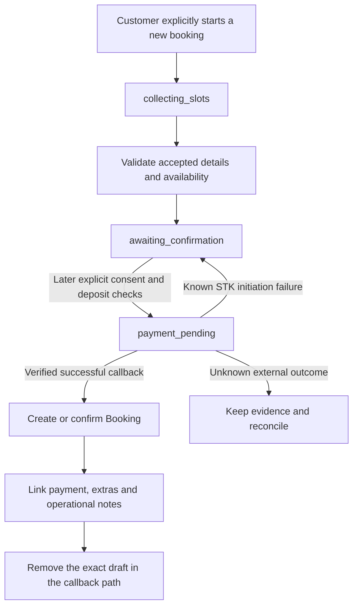
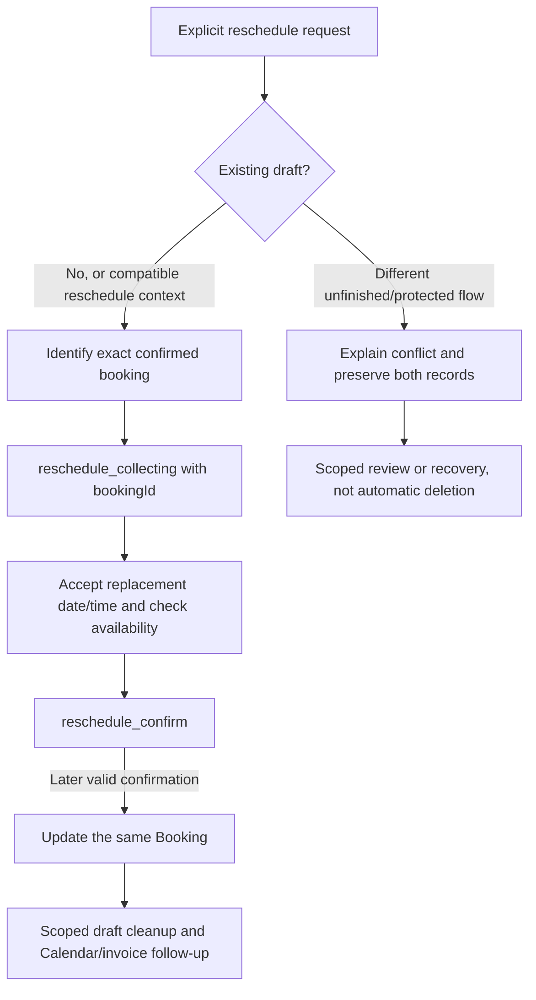

# Booking drafts: how the current system works

Updated: 2026-10-06. This README describes the current legacy runtime and the local
policy-routing correction. It does not claim the new workflow engine is live.

## 1. The distinction that explains the problem

A **Booking** is the actual session: its edition, date/time, status, recipient and
linked payments, extras and invoice. A confirmed paid session is a business record.

A **BookingDraft** is unfinished work: details being collected, a proposal waiting
for a decision, a payment step, or a proposed change to an existing session. It is
not proof that a session is booked, paid, cancelled or rescheduled.

A customer can have a confirmed booking and a draft at the same time. For example,
they may be booking another session or preparing to move an existing one. An old
draft may also remain after an interrupted or incorrectly routed conversation.
The application must distinguish these cases rather than assume any draft is safe
to discard. The reported live draft's contents have not been inspected here.

## 2. Where the data lives

The [Prisma schema](../prisma/schema.prisma) maps BookingDraft to `booking_drafts`.
Its `@@unique([customerId])` rule permits **one draft row per customer**, not one
per booking, channel or operation. New booking, payment, reschedule, cancellation
and recipient-collection paths compete for this shared row.

| Field | Meaning |
| --- | --- |
| id | Identity of this particular unfinished request; important for scoped cleanup |
| customerId | Account owner and unique lookup key |
| step | Which flow currently owns the row |
| service | Edition accepted for this request; not automatically the old booking's edition |
| date, time | Accepted local date/time, normally YYYY-MM-DD and HH:mm |
| dateTimeIso | Proposed instant in UTC; partial collection should not accidentally hold a slot |
| name | Collected name for the request; can be a recipient in a someone-else flow |
| recipientName, recipientPhone, isForSomeoneElse | Distinguishes account holder from session recipient |
| bookingId | Existing booking targeted by reschedule/cancellation; not the new booking's identity |
| cancelProposedAt | Fixed cancellation-proposal start timestamp for expiry |
| version | Currently participates in payment-attempt claiming/accounting; not a general conversation counter |
| createdAt, updatedAt | Row lifecycle timestamps; different flows currently use them differently |
| payment relation | Payment may refer to this draft before being linked to a Booking |

Customer.name, Booking and Payment remain separate sources of truth. A command
such as "Send me the invoice" or an acknowledgement must not become Customer.name.
Asking a question about a package is not choosing that package for a new draft.

## 3. What creates and updates a draft

### Early slot collection

[slot-memory.ts](../src/services/agent/slot-memory.ts) extracts explicitly stated
name/edition/date/time values. For a compatible collection flow it creates a draft
or updates the existing one, preserving accepted fields and copying a usable profile
name when appropriate. It uses `collecting_slots` for early collection.

If a date/time/name is collected but service is missing, it can return:

> Which package would you like for your session?

That reply may happen before the model runs. This caused the earlier reschedule
failure: a reference to "that Friday" was interpreted as a new-booking date before
reschedule intent was routed. The reschedule entry path now precedes slot capture.

The collector avoids protected steps such as awaiting_confirmation, payment_pending,
reschedule_confirm and cancel_confirm. It also avoids someone-else drafts and unknown
non-collection steps. These protections are not a complete multi-operation state machine.

### Booking proposal

[booking-draft.service.ts](../src/services/booking/booking-draft.service.ts) uses
saveBookingProposal to upsert the accepted edition, name and proposed date/time and
set `awaiting_confirmation`. Proposal preparation reuses validated availability and
deposit checks. A proposal does not send an M-Pesa prompt.

### Recipient collection

Some someone-else collection paths use `service` as the step and store recipient
identity on the draft. Older step names such as date/time/name/confirm appear in
schema comments or legacy paths; do not assume every commented step is the current
runtime's authoritative state. Inspect the actual row and its owning code path.

## 4. Current steps and responsibilities

| Step | What it represents | Important boundary |
| --- | --- | --- |
| service / collecting_slots | Unfinished new-booking or recipient details | No payment or confirmed booking is implied |
| awaiting_confirmation | Booking proposal waiting for a later customer decision | No STK push merely because a proposal exists |
| payment_pending | A deposit-payment flow has been claimed/opened | Read Payment records to know whether a prompt failed, succeeded or is uncertain |
| reschedule_collecting | Gathering replacement details for bookingId | Existing booking remains unchanged |
| reschedule_confirm | Replacement proposal awaiting explicit consent | Do not apply it in the same turn as its proposal |
| cancel_confirm | Cancellation proposal awaiting strict consent | No cancellation/refund has happened yet |
| other/expired/inconsistent state | Needs verified ownership and recovery | Do not silently treat it as a fresh empty conversation |

## 5. Booking and payment lifecycle



Before initiating payment, [booking-tools.ts](../src/services/agent/booking-tools.ts)
checks the prior-turn proposal state, required fields, availability, validated deposit,
the customer-visible proposed amount and attempt eligibility. markPaymentPending
claims the draft with a version condition to prevent a competing confirmation from
sending another prompt.

Current [payment-recovery.ts](../src/services/agent/payment-recovery.ts) derives
attempts from `BookingDraft.version - 1`, with a recorded-payment minimum where
appropriate. Do not increment version for every chat message or decrement it to
manufacture a retry. Generic workflow revisions must be independent.

A known initiation exception attempts to restore the same draft to awaiting_confirmation
and its prior version; it does not intentionally clear the name, edition or slots.
If an STK request may have been sent but its Payment record was not safely recorded,
the system must not blindly send another prompt. A draft's step alone is not evidence
that no payment occurred.

[payment.controller.ts](../src/controllers/payment.controller.ts) processes verified
payment outcomes separately. Its successful draft path creates the actual Booking,
attaches pending extras/notes, removes the draft and links payment to the booking.
Under-minimum production payments and paid-slot conflicts have separate paths:
payment receipt can remain successful without a new confirmed booking. Do not equate
draft deletion with booking success. Partial side-effect failures need reconciliation.

## 6. Rescheduling lifecycle and the conflict guard



getInitialRescheduleReply in [agent.service.ts](../src/services/agent/agent.service.ts)
first reads the customer draft. It permits no draft, compatible active reschedule
state, or a narrow empty early draft with no service/date. It does not replace an
unfinished collection with a date, a booking proposal, an open payment step or an
unknown state just because the customer asks to reschedule.

This is why repeating "reschedule it" can produce a block repeatedly: the persisted
row is still there. Restarting Node, changing the model or losing chat history does
not resolve that row. The guarded reply now explains the category rather than just
saying "resolve the existing step"; it does not assert that the draft is a genuine
separate booking or that an actual payment failed.

Reschedule context stores bookingId and service. Date-only picks can retain the
replacement date for a later time answer. Reference/unavailable clauses such as
"I will be busy that Friday" should not supply the replacement date. Proposal queries
stay bound to the stored bookingId. Completion updates the same booking and scopes
cleanup to the draft ID/customer/step/booking ID instead of clearing all customer work.

Calendar and invoice updates are separate effects. A successful database date change
does not prove that every projection or customer message succeeded. This remains a
reconciliation boundary; the proposed new workflow outbox is not live yet.

## 7. The policy-query correction

Previously isInitialRescheduleRequest treated "rescheduling" in the policy question
as an action keyword. The pre-slot reschedule guard then returned a conflict message
instead of answering the policy, even though no change had been requested.

The correction adds:

- isBookingPolicyQuestion: identifies reschedule/cancellation/refund policy enquiries.
- bookingPolicyInformation: a deterministic informational route before slot capture
  and rescheduleEntry. It does not query or overwrite collection/payment/reschedule drafts.
- A matcher exclusion so a policy enquiry is not itself an initial reschedule action.
- State-specific conflict explanations for actual requests, preserving the existing draft.
- A blocked reschedule outcome (`success: false`, not a provider fallback) rather than
  recording an unresolved requested action as successful just because text was returned.

The current generic reply is:

> Rescheduling: Changes within 72 hours before your session forfeit the deposit.
> At exactly 72 hours, the current rule does not forfeit it.
>
> Cancellation: Refund eligibility applies only when cancelling more than 72 hours
> before the session. At 72 hours or less, the deposit is not eligible for a refund.
> A new booking requires a new deposit.
>
> No booking change or cancellation has been made.

It uses the existing policy constant. The existing function is strictly less than
72 hours for future-session reschedule forfeiture, and strictly more than 72 hours
for cancellation refund eligibility. Equality is asymmetric; no financial rule was
changed to conceal that boundary. Eligibility is not a promise that a refund was paid.

Pending cancellation consent has its own pre-routing invalidation rules. A policy
enquiry following an actual cancellation proposal may invalidate that old consent
as an unrelated turn. This does not cancel the Booking and is not permission to
reset collection or payment drafts. The policy tests cover preserved collecting,
proposal, payment and reschedule-collection drafts, not a relaxation of cancellation consent.

## 8. Expiry and cleanup are not one universal timer

| Flow | Current timing source | What not to infer |
| --- | --- | --- |
| Early collecting slots | 14-day retention checked from createdAt | A recent message does not necessarily make an old row newly created |
| Reschedule context | 24 hours, currently checked against updatedAt | Expiry does not move/cancel the confirmed booking or certify deletion safety |
| Cancellation proposal | One hour from cancelProposedAt | A casual okay or later stale yes is not cancellation consent |
| Payment hold | 15 minutes under current payment-recovery rules | Hold expiry does not prove an external STK request failed |
| Payment prompt age | Two-minute timeout interpretation with retry cooldown/attempt guards | Timeout is not a reason to discard payment evidence or send unlimited retries |

Some expiry is evaluated only when that code path is reached. There is no general
guarantee that restarting the app deletes all expired/conflicting rows. createdAt
and updatedAt currently serve different purposes; this is one reason the reviewed
design calls for independent operation deadlines and revisions.

## 9. Worked example matching the reported problem

A hypothetical conflicting row could be:

```json
{
  "id": "synthetic-draft",
  "customerId": "synthetic-customer",
  "step": "collecting_slots",
  "service": null,
  "date": "2026-10-10",
  "time": "10:00",
  "name": "Synthetic Customer",
  "bookingId": null,
  "version": 1
}
```

The customer may separately have a paid confirmed Muse booking. A previous misrouted
message can populate a collection date/time without service. The guard sees a dated
unfinished request, not an empty replaceable draft, and preserves it. That does not
mean the confirmed booking was forgotten.

This is a reproduction hypothesis, not a live-row finding. The actual draft could
be a valid second request, awaiting confirmation, an unresolved payment, or another
state. The fix answers policy questions without touching it. Actual rescheduling
still requires its identity, state and financial links to be reviewed before recovery.

## 10. Safe inspection and recovery checklist

Use an explicitly approved target and scope; never automatically use the backend
environment for an investigation or paste connection secrets into chat.

1. Read only the exact customer's draft: id, step, bookingId, accepted fields,
   createdAt, updatedAt, cancelProposedAt and version.
2. Read the exact relevant confirmed booking(s), successful and pending Payment
   links, checkout identities, invoice and add-on/session-note relationships.
3. Classify it: genuine active request, proposal needing a decision, open/unknown
   payment, compatible reschedule, proven expired collection, or uncertain legacy state.
4. Preserve and reconcile unresolved payment effects. A generic Payment lookup
   returning no row once is not proof that an external request was never dispatched.
5. Obtain explicit permission for any targeted repair. Match the inspected id,
   customer, step, booking linkage/version and unchanged facts in the mutation.
6. Re-read afterward. Preserve Booking, Payment, Invoice and Calendar history;
   verify that unrelated work was not removed. Never mass-delete drafts by phone number.

No SQL repair or live cleanup is performed by this README or this code correction.
The disposable local database is for synthetic rehearsal, not a copy of live customers.

## 11. History, model and the new engine

Raw history is a limited conversational window. It helps interpretation, but is not
the authoritative storage for a booking, payment, name or operation. The model may
ask for details or say "sure" even while code has preserved a conflicting draft;
that wording cannot resolve the conflict. The legacy runtime still contains some
history-based follow-up decisions, and this correction does not replace all of them.

[WORKFLOW_ENGINE_CORE.md](WORKFLOW_ENGINE_CORE.md) describes the tested pure engine.
It plans decisions but is not called by live handleMessage yet. The disposable
database has no workflow schema installed. Persistent blocks, proposal evidence,
writer fencing, command execution and integration replay gates remain separate work.
Do not mistake the 20 core unit tests for live state recovery or automatic migrations.

## 12. Validation and source map

The correction's regressions require policy replies while four draft categories
remain unchanged, with no availability lookup, draft creation/deletion, booking
mutation or Calendar call. Separate cases preserve actual action detection and verify
state-specific conflict wording. Tests use synthetic state and mocked integrations.

Useful implementation files:

- [schema.prisma](../prisma/schema.prisma): one-row constraint, fields and relationships.
- [slot-memory.ts](../src/services/agent/slot-memory.ts): extraction, collection, expiry and name guards.
- [booking-progress.ts](../src/services/agent/booking-progress.ts): deterministic next missing step.
- [booking-draft.service.ts](../src/services/booking/booking-draft.service.ts): proposal upsert and payment claim.
- [booking-tools.ts](../src/services/agent/booking-tools.ts): proposals, payment and confirmed-change guards.
- [payment-recovery.ts](../src/services/agent/payment-recovery.ts): attempt accounting, holds and retry state.
- [payment.controller.ts](../src/controllers/payment.controller.ts): callback result and promotion/cleanup paths.
- [routes.ts](../src/services/agent/routes.ts): informational policy versus action routing.
- [booking-policy.ts](../src/utils/booking-policy.ts): exact existing policy thresholds.

Run local mocked checks with live database access disabled. The workspace task
"Backend offline regression tests" does that for npm test. No customer message,
real M-Pesa prompt, Calendar action or live-row cleanup is needed to validate this fix.